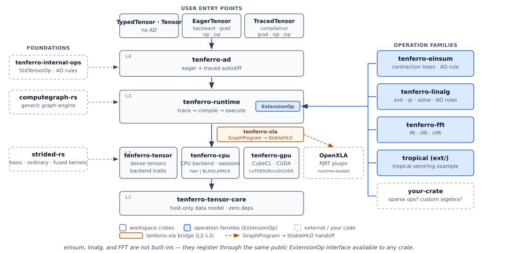
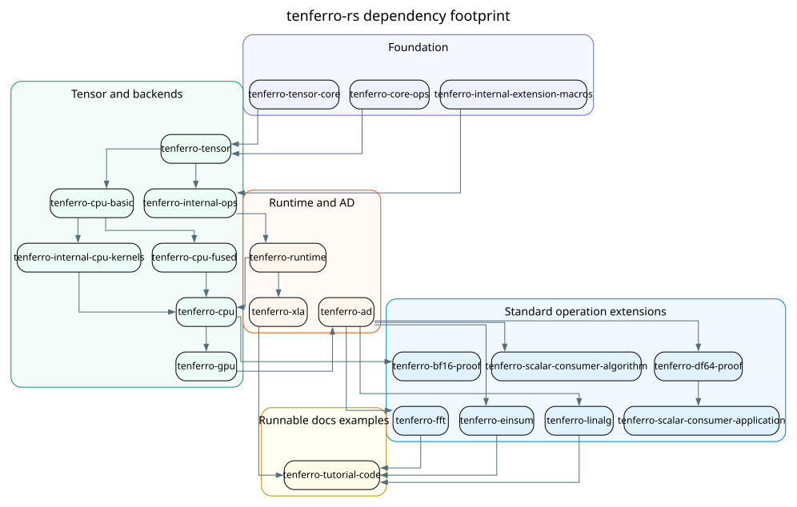

# tenferro-rs

**A Rust-native tensor computation stack with opt-in autodiff for scientific workloads.**

[](https://github.com/tensor4all/tenferro-rs/actions/workflows/ci.yml)
[](https://crates.io/crates/tenferro-runtime)
[](https://tensor4all.org/tenferro-rs/)
[](https://github.com/tensor4all/tenferro-benchmark)
[](LICENSE-MIT)

tenferro-rs provides typed and dynamic dense tensors, explicit backend
dispatch, linear algebra, einsum, FFT, and extensible automatic differentiation
native to Rust. Use it as an ordinary tensor library first: direct
`TypedTensor` and `Tensor` APIs run through a chosen CPU, CUDA, or experimental
WebGPU backend, while `EagerTensor` and `TracedTensor` add automatic
differentiation when a workflow needs it. Both eager and traced modes support
VJP and JVP. Eager mode also supports PyTorch-style `backward()` for scalar
losses, while traced mode is the main surface for reusable graph transforms and
HVP-style higher-order composition.

Positioning: tenferro-rs sits between low-level array crates and full
deep-learning frameworks for Rust scientific code that needs column-major
storage, LAPACK/Fortran/Julia-friendly layouts, dynamic-shape traced programs,
explicit device control, and operation families whose AD rules can live outside
the core tensor type.

Performance is tracked openly: the
[tenferro-benchmark](https://github.com/tensor4all/tenferro-benchmark) suite
publishes reproducible CPU and GPU comparisons against PyTorch and JAX,
including the published result tables, for every workload class tenferro
targets.



## Quickstart A: Direct Tensor Compute

Add the runtime, CPU backend, and linear algebra extension crates:

```toml
[dependencies]
tenferro-runtime = "0.2"
tenferro-cpu = "0.2"
tenferro-linalg = "0.2"
```

<!-- snippet-source: docs/tutorial-code/src/bin/direct_linalg_quickstart.rs -->
```rust
use tenferro_cpu::{with_cpu_exec_session, CpuBackend};
use tenferro_linalg::LinalgBackend;
use tenferro_runtime::{
    BackendSessionHost, TensorRead, TensorView, TypedTensor, TypedTensorOpsExt,
};

fn assert_close(actual: &[f64], expected: &[f64]) {
    assert_eq!(actual.len(), expected.len());
    for (index, (actual, expected)) in actual.iter().zip(expected).enumerate() {
        let error = (actual - expected).abs();
        assert!(
            error < 1.0e-12,
            "value {index}: actual={actual}, expected={expected}, error={error}"
        );
    }
}

fn main() -> Result<(), Box<dyn std::error::Error>> {
    let mut backend = CpuBackend::new();

    let a = TypedTensor::<f64>::from_vec_col_major(vec![2, 2], vec![3.0, 0.0, 0.0, 1.0])?;
    let identity = TypedTensor::<f64>::from_vec_col_major(vec![2, 2], vec![1.0, 0.0, 0.0, 1.0])?;

    let product = a.matmul(&identity, &mut backend)?;
    assert_eq!(product.shape(), &[2, 2]);
    assert_close(product.host_data()?, &[3.0, 0.0, 0.0, 1.0]);

    let svd = backend.with_backend_session(|session| {
        with_cpu_exec_session(session, |exec_session| {
            exec_session.svd_read(TensorRead::from_view(TensorView::F64(product.as_view())))
        })
        .expect("CpuBackend must expose a CPU execution session")
    })?;
    assert_eq!(svd.len(), 3);
    assert_eq!(svd[0].shape(), &[2, 2]);
    assert_eq!(svd[1].shape(), &[2]);
    assert_eq!(svd[2].shape(), &[2, 2]);
    assert_close(svd[1].as_slice::<f64>().unwrap(), &[3.0, 1.0]);

    Ok(())
}
```
<!-- end-snippet-source -->

## Quickstart B: Traced AD

Add `tenferro-ad` when the same tensor stack needs graph-based `grad`, `vjp`,
or `jvp`:

```toml
[dependencies]
tenferro-runtime = "0.2"
tenferro-cpu = "0.2"
tenferro-ad = "0.2"
```

<!-- snippet-source: docs/tutorial-code/src/bin/traced_autodiff_jax_style.rs -->
```rust
use tenferro_ad::TracedTensorAdExt;
use tenferro_cpu::CpuBackend;
use tenferro_runtime::{GraphCompiler, Runtime, TracedTensor};

fn assert_close(actual: &[f64], expected: &[f64]) {
    assert_eq!(actual.len(), expected.len());
    for (index, (actual, expected)) in actual.iter().zip(expected).enumerate() {
        let error = (actual - expected).abs();
        assert!(
            error < 1.0e-12,
            "value {index}: actual={actual}, expected={expected}, error={error}"
        );
    }
}

fn run(tensor: &TracedTensor) -> Result<tenferro_runtime::Tensor, tenferro_runtime::Error> {
    let mut compiler = GraphCompiler::new();
    let program = compiler.compile(tensor)?;
    let backend = CpuBackend::new();
    let mut builder = Runtime::builder();
    let registration = tenferro_cpu::runtime_engine_registration(&backend).map_err(|source| {
        tenferro_runtime::Error::runtime_state_source(
            "tutorial_runtime",
            tenferro_runtime::ErrorPhase::Execution,
            source,
        )
    })?;
    builder.register_engine(registration).map_err(|source| {
        tenferro_runtime::Error::runtime_state_source(
            "tutorial_runtime",
            tenferro_runtime::ErrorPhase::Execution,
            source,
        )
    })?;
    let runtime = builder.build().map_err(|source| {
        tenferro_runtime::Error::runtime_state_source(
            "tutorial_runtime",
            tenferro_runtime::ErrorPhase::Execution,
            source,
        )
    })?;
    let mut outputs = runtime.run_compiled(&program, &[])?;
    assert_eq!(outputs.len(), 1);
    Ok(outputs.remove(0))
}

fn main() -> Result<(), Box<dyn std::error::Error>> {
    let x = TracedTensor::from_vec_col_major(vec![3], vec![1.0_f64, 2.0, 3.0])?;
    let y = (&x * &x)?.reduce_sum(Some(&[0]))?;

    let y_value = run(&y)?;
    assert_eq!(y_value.shape(), &[] as &[usize]);
    assert_close(y_value.as_slice::<f64>().unwrap(), &[14.0]);

    let grad = y.grad(&x)?;
    let grad_value = run(&grad)?;
    assert_eq!(grad_value.shape(), &[3]);
    assert_close(grad_value.as_slice::<f64>().unwrap(), &[2.0, 4.0, 6.0]);

    let tangent = TracedTensor::from_vec_col_major(vec![3], vec![0.1_f64, 1.0, -2.0])?;
    let directional = y.jvp(&x, &tangent)?;
    let directional_value = run(&directional)?;
    assert_eq!(directional_value.shape(), &[] as &[usize]);
    assert_close(directional_value.as_slice::<f64>().unwrap(), &[-7.8]);

    Ok(())
}
```
<!-- end-snippet-source -->

For PyTorch-style eager autodiff with `backward()` and functional
`EagerRuntime` transforms, see the
[eager autodiff tutorial](https://tensor4all.org/tenferro-rs/tutorials/eager-autodiff-pytorch-style.html).
Setup notes, including local-checkout builds and BLAS provider selection, are
in [Getting Started](https://tensor4all.org/tenferro-rs/getting-started/index.html).

## Is tenferro for You?

tenferro-rs is a good fit when:

- **Shapes are only known at runtime.** A traced program is compiled once and
  reused while ranks, truncation thresholds, and data-dependent iteration
  counts resolve at execution time — the daily reality of tensor networks and
  much of adaptive scientific computing (see
  [dynamic and symbolic shapes](https://tensor4all.org/tenferro-rs/design/dynamic-symbolic-shapes.html)).
- **You want autodiff in Rust without a Python runtime.** `backward()` on eager
  scalar losses; VJP and JVP in both eager and traced modes; HVP-style
  higher-order composition on reusable traced graphs; shipped as a single
  binary.
- **Your data lives in the column-major world.** Storage matches Fortran,
  Julia, MATLAB, and LAPACK/BLAS conventions, and strided views bridge
  row-major data without eager copies (see
  [memory order](https://tensor4all.org/tenferro-rs/guides/memory-order.html)).
- **You need operations the core does not ship.** Operations and their AD
  rules live outside the core tensor type, so an external crate can add an
  operation family — even a different algebra, such as the tropical-semiring
  example — and it flows through the same eager and traced autodiff (see
  [custom operations](https://tensor4all.org/tenferro-rs/guides/custom-operations.html)).

tenferro-rs deliberately builds on the Rust numerics ecosystem instead of
replacing it: [`faer`](https://github.com/sarah-quinones/faer-rs) for dense
linear algebra, [CubeCL](https://github.com/tracel-ai/cubecl) for GPU
kernels, [`omeco`](https://crates.io/crates/omeco) for contraction ordering,
and [`num-traits`](https://github.com/rust-num/num-traits) /
[`num-complex`](https://github.com/rust-num/num-complex) for generic
numerics.

Where else to look: [ndarray](https://github.com/rust-ndarray/ndarray) for
general N-dimensional arrays without autodiff or traced graphs;
[faer](https://github.com/sarah-quinones/faer-rs) directly for pure dense
linear algebra; [Burn](https://github.com/tracel-ai/burn) and
[candle](https://github.com/huggingface/candle) for deep-learning workloads.
If your host language is Python, JAX and PyTorch are the natural choice —
tenferro-rs is for projects that want this kind of stack natively in Rust.

## Which API Should I Use?

| If your workflow needs | Start with |
| --- | --- |
| Fixed scalar type, ordinary tensor computation, no autodiff | `TypedTensor<T, R>` |
| Runtime dtype selection or direct backend dispatch | `Tensor` with an explicit backend |
| Immediate execution in one runtime, optionally with `backward()`, VJP, or JVP | `EagerTensor` and `EagerRuntime` |
| Reusable graph transforms, including `grad`, VJP/JVP, and HVP-style composition | `TracedTensor`, `GraphCompiler`, and `Runtime::run_compiled` |
| CUDA or experimental WebGPU execution | The same tensor API plus explicit GPU upload/download and supported provider backend features |
| Static-shaped StableHLO and PJRT plugin experiments | `GraphCompiler` plus `tenferro-xla` |

## Crates

tenferro-rs is a multi-crate workspace. There is intentionally no `tenferro` facade crate;
depend directly on the crates you need, starting with the smallest API that
solves your problem.



### Core User Crates

| Crate | Use when you need |
| --- | --- |
| `tenferro-tensor` | Tensor values, typed tensors, views, dtype/runtime tensor contracts, and backend traits |
| `tenferro-cpu` | CPU backend execution |
| `tenferro-gpu` | CUDA backend support, experimental WebGPU support, future ROCm substrate, and explicit device transfers |
| `tenferro-runtime` | Eager/traced execution, graph compilation, and extension runtime support |
| `tenferro-ad` | Automatic differentiation |
| `tenferro-xla` | Experimental StableHLO lowering and runtime-loaded PJRT plugin support for static-shaped traced graphs |

### Standard Operation Extensions

| Crate | Use when you need |
| --- | --- |
| `tenferro-linalg` | Linear algebra operations |
| `tenferro-einsum` | Einsum and contraction planning |
| `tenferro-fft` | FFT operations |

### Standalone Examples

| Path | Use when you need |
| --- | --- |
| `ext/tenferro-cpu-tblis` | An unpublished external CPU provider example that replaces only supported `dot_general` contractions with TBLIS |

### Implementation Crates

The crates `tenferro-tensor-core`, `tenferro-core-ops`,
`tenferro-internal-cpu-kernels`, `tenferro-internal-ops`, and
`tenferro-internal-extension-macros` are published building blocks for the
crates above; most users never depend on them directly.
For current backend operation coverage, start with the hand-written
[Devices and GPU coverage table](https://tensor4all.org/tenferro-rs/guides/devices-and-gpu.html#coverage).

## Documentation

The full guides, tutorials, API reference, architecture notes, and
specifications live at <https://tensor4all.org/tenferro-rs/>. Start with
[Getting Started](https://tensor4all.org/tenferro-rs/getting-started/index.html);
PyTorch/JAX users can also jump in through the
[PyTorch and JAX mapping](https://tensor4all.org/tenferro-rs/getting-started/pytorch-jax-mapping.html).

Selected deep dives:

- [Storage ownership](https://tensor4all.org/tenferro-rs/storage-ownership.html)
  — one physical owner, borrowed views, explicit copies/transfers, and prepared
  access boundaries.
- [Views and slicing](https://tensor4all.org/tenferro-rs/guides/views-and-slicing.html)
  — static-rank views, mutable disjointness, and explicit `duplicate()`.
- [Devices and GPU](https://tensor4all.org/tenferro-rs/guides/devices-and-gpu.html)
  — explicit CPU, CUDA, and experimental WebGPU control; tensors never move
  between devices silently.
- [Dynamic and symbolic shapes](https://tensor4all.org/tenferro-rs/design/dynamic-symbolic-shapes.html)
  — how runtime-dependent dimensions work in traced programs.
- [XLA and PJRT](https://tensor4all.org/tenferro-rs/guides/xla.html)
  — experimental StableHLO lowering and PJRT plugin loading for static-shaped
  graphs via `tenferro-xla`.
- [Custom operations](https://tensor4all.org/tenferro-rs/guides/custom-operations.html)
  — extension operations and AD rules from external crates.

## Project

**Why tenferro-rs exists.** Moving tensor-network engines from Julia to Rust
exposed a missing layer: a scientific-computing tensor stack between ndarray,
faer, and the deep-learning frameworks — column-major, dynamic-shape,
autodiff-capable, and extensible. tenferro-rs fills that layer and bridges to
the Fortran/LAPACK, Julia, and JAX/PyTorch worlds. The background story is in
the introduction post:
[From Julia to Rust: a differentiable tensor stack for scientific computing in the agentic AI era](https://tensor4all.org/blog/introducing-tenferro-rs/).

**Stability.** tenferro-rs is a pre-1.0 experimental research platform;
public APIs may change substantially, including across 0.x releases. Pin
exact versions or commits, and follow the current documentation as the
primary reference — migration notes accompany major breaking changes. The
stack is dogfooded in
[tensor4all-rs](https://github.com/tensor4all/tensor4all-rs) and related
tensor4all projects.

**Engineering discipline.** Numerical correctness — especially automatic
differentiation — is validated against reference oracles (finite-difference
and Torch reference data in
[tensor-ad-oracles](https://github.com/tensor4all/tensor-ad-oracles); see the
[oracle support table](https://tensor4all.org/tenferro-rs/oracle/tensor-ad-oracles-support.html)),
enforced per-file coverage thresholds, and the reproducible
[tenferro-benchmark](https://github.com/tensor4all/tenferro-benchmark) suite.
Every documentation example compiles and runs in CI.

**AI-assisted development.** tenferro-rs assumes AI-assisted and agentic
coding for development, migration, and review. AI output is never accepted as
authority by itself: changes are validated against repository rules
([REPOSITORY_RULES.md](REPOSITORY_RULES.md)), oracle checks, CI, reproducible
benchmarks, and maintainer review, with design records under
[docs/design/](docs/design/) and [docs/worklogs/](docs/worklogs/) keeping the
process coherent. Why we work this way is part of the
[introduction post](https://tensor4all.org/blog/introducing-tenferro-rs/).

## Community

Questions, design discussions, and contributor coordination happen in the
tenferro Matrix room:

- [#tenferro-tensor4all:matrix.org](https://matrix.to/#/#tenferro-tensor4all:matrix.org)

Use GitHub issues for bug reports, feature requests, and decisions that need
tracking; use Matrix for lightweight discussion before filing or implementing
changes. The broader tensor4all community uses the
[tensor4all mailing list](https://groups.google.com/g/tensor4all) for
announcements, and the community entry point is <https://tensor4all.org/>.

## Acknowledgments

tenferro-rs stands on excellent work across several ecosystems, and aims to
integrate with and contribute back to them.

- **GPU.** The GPU backend builds on
  [CubeCL](https://github.com/tracel-ai/cubecl) by the
  [tracel-ai](https://github.com/tracel-ai) team (also the foundation of
  [Burn](https://github.com/tracel-ai/burn)). The temporary `t4a-*` crates
  stage tensor4all patches until they land upstream.
- **CPU / numerics.** Dense CPU linear algebra builds on
  [`faer`](https://github.com/sarah-quinones/faer-rs), with numeric
  foundations from [`num-traits`](https://github.com/rust-num/num-traits) and
  [`num-complex`](https://github.com/rust-num/num-complex).
- **Contraction ordering.** Einsum contraction-order optimization uses
  [`omeco`](https://crates.io/crates/omeco), carrying over ideas from the
  Julia tensor-network ecosystem.
- **Design heritage.** Operation semantics and AD rules living outside an
  all-in-one tensor type follow the Julia numerical-computing community
  (ChainRules, OMEinsum). Autodiff is implemented by `tenferro-ad` and
  `tenferro-internal-ops`, with extension families registering semantic AD
  rules rather than embedding formulas in an all-in-one tensor type.
- **JAX.** The traced-graph compilation and trace-then-transform autodiff
  architecture follow JAX: linearize-then-transpose AD, the `dot_general`
  contraction primitive and StableHLO-style op vocabulary, the JAX-compatible
  einsum contraction-path format, and individual AD-rule conventions such as
  the complex SVD gauge correction and gradient seed conventions.
- **PyTorch.** Eager execution with `backward()` follows PyTorch's API
  shape. PyTorch's manual autograd formulas (`derivatives.yaml`,
  `FunctionsManual.cpp`, the `handle_r_to_c` convention) serve as comparison
  baselines for AD rules, and the
  [tensor-ad-oracles](https://github.com/tensor4all/tensor-ad-oracles)
  reference data is generated by running PyTorch and cross-checking against
  independent finite differences. No source code from either project is
  copied; the oracle data contains numeric values and provenance metadata
  only.

Thanks to these projects, communities, and their maintainers.

A per-component table of which external projects each crate builds on, and
the algorithm-origin references, is maintained in the
[Provenance and Citation Policy](docs/PROVENANCE_AND_CITATION_POLICY.md).

## How to Cite

If you use tenferro-rs in research, please read the
[Provenance and Citation Policy](docs/PROVENANCE_AND_CITATION_POLICY.md)
and cite the original papers of the algorithms your work relies on, and
check the citation policies of the upstream projects the components you use
build on, applying them recursively. This is the permanent citation style
for this project: a future tenferro-rs software paper will add to, not
replace, these upstream citations. Until then, reference tenferro-rs
directly by repository URL and version or commit.

## Contributing

Bug reports, minimal reproducers, proposed regression tests, feature
requests, design discussions, documentation improvements, benchmark reports,
and prototype branches are welcome in issues. Pull request creation is
currently restricted to collaborators, and collaborator feature PRs must
start from accepted feature-request issues.

See [CONTRIBUTING.md](CONTRIBUTING.md) for the contribution policy and the
supported AI-assisted workflows, and [GOVERNANCE.md](GOVERNANCE.md) for
maintainer roles, merge authority, and the project-direction decision model.
Maintainers are listed in [CONTRIBUTORS.md](CONTRIBUTORS.md).
