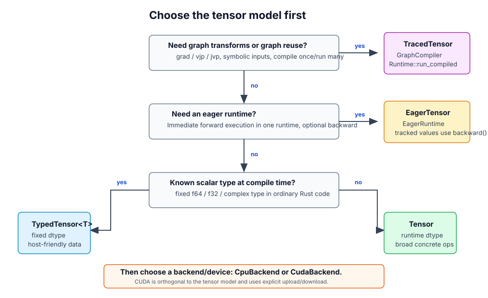

# Choosing a Tensor API

This page is about choosing the tensor API that matches your workflow.
tenferro separates the value you pass around, when computation runs, and which
backend or device executes the work.

## Start Here

For most projects without autodiff, `TypedTensor<T, R>` or `Tensor` should
come first. Move to `EagerTensor` when you want immediate execution under an
`EagerRuntime`; make tensors tracked when the workflow needs `backward()` on
scalar losses or functional eager `grad`, `vjp`, `jvp`, and HVP composition.
Move to `TracedTensor` when the workflow needs those transforms on compiled
graphs.

Quick reference:

| If your project needs | Start with |
| --- | --- |
| No autodiff, scalar type known at compile time | `TypedTensor<T, R>` |
| No autodiff, dtype selected at runtime | `Tensor` |
| Immediate forward execution in one runtime, optionally `backward()` or functional `grad`/`vjp`/`jvp` | `EagerTensor` + `EagerRuntime` |
| `grad`, `vjp`, `jvp`, HVP via composition, graph reuse | `TracedTensor` + `GraphCompiler` + `Runtime::run_compiled` |

## Import Style

Use direct imports when a small module should make its dependencies explicit:
`use tenferro_runtime::{Tensor, TensorSessionOpsExt};` and
`use tenferro_linalg::TensorLinalgExt;`. For tutorials or
modules using several operation traits, the equivalent crate-local preludes are
`use tenferro_runtime::prelude::*;` and `use tenferro_linalg::prelude::*;`.
There is no facade prelude: keep each operation family imported from its own
crate. The prelude imports extension traits and common associated types; it
does not change backend selection or execution semantics.

## Tensor Types

`TypedTensor<T, R = DynRank>` owns runtime tensor data with a compile-time
scalar type and optional compile-time rank marker. Owned values use tenferro's
column-major layout. Strided views use `TypedTensorView` and
`TypedTensorViewMut`.

`Tensor` owns the same kind of dense data, but wraps supported scalar types in
a runtime dtype enum and remains dynamic-rank. Use it when dtype must be
selected dynamically, when you want the broad concrete tensor operation
API, or when you need to pass CPU or CUDA tensors through backend dispatch.

`tenferro-tensor-core` is lower-level: it owns rank/layout metadata and
host-only adapters such as `HostTensor<T>`, not the backend-capable
`TypedTensor<T, R>`.

`EagerTensor` is concrete eager execution. It wraps `Tensor` values in an
`EagerRuntime`, so each operation computes a concrete result immediately.
Untracked eager tensors are forward-only. Tracked eager tensors additionally
record reverse-mode state for `backward()` on scalar losses and can feed
`EagerRuntime` functional `grad`, `vjp`, and `jvp` transforms.

`TracedTensor` is a graph-building handle. It is the graph and compilation API,
not the default concrete tensor type.

## Execution Model

| Model | Similar to | What happens on each op |
| --- | --- | --- |
| Direct tensor execution | NumPy-style explicit backend calls | The backend runs the op immediately and returns a concrete `Tensor` |
| Eager execution | PyTorch eager/autograd | The op runs immediately; tracked values record enough state for `backward()` and functional eager transforms |
| Traced execution | JAX tracing/jit/grad | The op records graph structure; compute runs after compile/execute |

See [Execution Models](execution-models.md) for the time-axis diagram,
including the difference between Eager CPU, Eager GPU, and Traced mode.

## Device And Backend

CPU and CUDA are backend choices. They do not decide whether your program is
typed, eager, or traced.

CUDA support is provided by the feature-gated CUDA backend for concrete,
eager, and traced workflows. CPU/GPU transfer is explicit:

- upload CPU tensors before CUDA backend operations,
- keep intermediate tensors on CUDA while doing CUDA work,
- download only when the host must inspect values,
- do not expect an unsupported CUDA operation to silently fall back to CPU.

Operations that require compact storage may copy a view into compact storage on
the same device. They do not silently upload CPU tensors or download CUDA
tensors.

The current CUDA operation and dtype table is in
[Devices and GPU](devices-and-gpu.md).

## Operation Entry Points

Choose the tensor API first, then choose the operation family. CUDA is not a
separate operation entry point; it is a backend/device choice for supported
operations.

| Need | Without autodiff | Eager path | Traced path |
| --- | --- | --- | --- |
| Everyday tensor ops | `TensorSessionOpsExt` / `TypedTensorSessionOpsExt` session-explicit methods | `EagerTensor` methods / associated functions | `TracedTensor` methods / associated functions |
| Einsum | `[&a, &b].einsum(...)` via `TensorEinsumExt` / `TypedTensorEinsumExt`; `TensorReadEinsumExt` / `TypedTensorReadEinsumExt` for views; `ConcreteEinsumPlan` for repeated fixed metadata | `[&a, &b].einsum(...)` via `EagerEinsumExt` | `trace.einsum(...)` via `TraceContextEinsumExt` plus `extension_module` |
| FFT | `x.fft(...)` via `TensorFftExt`; `read.fft_read(...)` via `TensorReadFftExt` | `x.fft(...)` via `EagerTensorFftExt` with `autodiff` | `x.fft(...)` via `TracedTensorFftExt` plus `extension_module` |
| Tensordot sugar | Use `matmul` or `dot_general` directly | `a.tensordot(&b, axes)` via `EagerTensorEinsumExt` | `a.tensordot(&b, axes)` via `TracedTensorEinsumExt` |
| Linear algebra | `TensorLinalgExt` session methods via `with_backend_session` | `EagerTensorLinalgExt` methods with `autodiff` | `TracedTensorLinalgExt` methods |
| Automatic differentiation | Not applicable | `backward()` plus `EagerRuntime` functional `grad`, `vjp`, `jvp`, HVP via composition | `grad`, `vjp`, `jvp`, HVP via composition |
| External operations | Extension-defined concrete hooks | Extension-defined eager hooks and optional AD rules | Extension-defined graph hooks and optional AD rules |

Use CPU or CUDA with these paths according to backend coverage. CUDA tensors
must be moved explicitly with upload/download helpers, and unsupported CUDA
operations do not silently fall back to CPU.

## Extension Model

Automatic differentiation is externally extensible. An extension crate can add
operations, eager/traced execution hooks, and AD rules without forcing the core
crate to grow application-specific APIs. [FFT (extension)](tenferro-fft.md) is
the example extension package: it adds Fourier transform operations and
registers AD rules for supported transforms.
