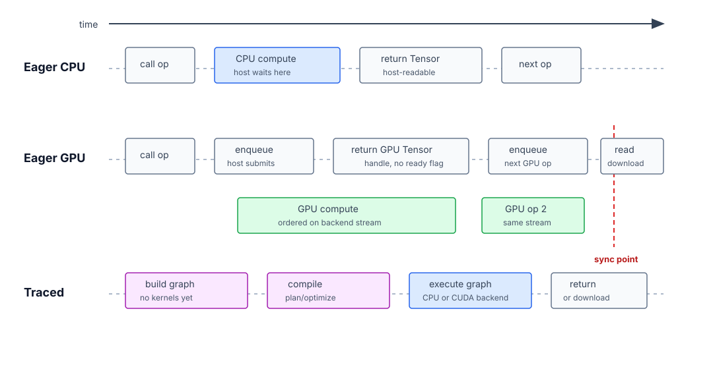

# Execution Models

tenferro supports direct execution, PyTorch-like eager execution with optional
stateful and functional AD, and JAX-like traced graph execution on the same
dense tensor stack. The key distinction is when work is submitted and when the
host waits for results.

## Eager CPU

Direct CPU tensor operations and eager CPU operations run immediately. A call
enters the CPU backend, the CPU work completes, and the returned value is
host-readable.

This is the easiest model for debugging and for ordinary numeric code without
autodiff.
Use `TypedTensor<T, R>` or `Tensor` when no gradient state is needed.
`TypedTensor<T, R>` carries the scalar type in Rust; `Tensor` stores dtype at
runtime. Use `EagerTensor` when you want immediate forward execution through an
`EagerRuntime`. Make tensors tracked for PyTorch-style `backward()` on scalar
losses, or call the runtime functional APIs (`grad`, `vjp`, `jvp`) when the
derivative should be returned as another eager tensor.

## Eager GPU

Eager GPU work is immediate at the Rust API boundary, but it is not a ready
flag API and it does not imply host synchronization after every kernel. An op
submits work to the CUDA backend and returns a CUDA-resident `Tensor` handle.
Subsequent CUDA ops can consume that handle on the same backend stream.

The host waits when values are downloaded or otherwise need host inspection.
Some library-backed operations also synchronize internally when they must read
device-side status. Call `EagerRuntime::synchronize()` when a workflow needs an
explicit host-side barrier without downloading tensor values.

## Traced Mode

Traced mode records operations into a graph first. It is similar to JAX's
tracing and `jit` workflow: build the expression, compile it, then run the
compiled program through a `GraphExecutor<B>`.

Use traced mode for symbolic inputs, graph optimization, repeated execution,
and compiled `grad`, `vjp`, `jvp`, and HVP workflows. The executor backend
decides whether the compiled program runs on CPU or CUDA for supported
operations.

### Dynamic Shapes in Traced Mode

Traced programs can carry shape metadata whose exact size is resolved at
execution time. That lets operations such as truncated SVD return a rank chosen
from the input values and still feed later traced operations without re-tracing
or padding to a fixed rank.

This is the main difference from shape-specialized compilation systems such as
JAX/XLA. Static-shape workloads can benefit from aggressive specialization;
runtime-rank workflows need a representation that keeps exact, upper-bound, or
unknown extents in the program until dispatch. See
[Dynamic and Symbolic Shape Metadata](../design/dynamic-symbolic-shapes.md) for
the implementation contract.

## Why Support Both?

Eager and traced serve different workflows on the same tensor stack.

| Need | Better fit |
| --- | --- |
| Inspect intermediate values while developing | Eager CPU or eager GPU with explicit download |
| Immediate forward execution through one runtime | `EagerTensor` |
| Reverse-mode AD on scalar losses with gradient accumulation | tracked `EagerTensor` variables + `backward()` |
| Functional eager `grad`, `vjp`, `jvp`, or HVP composition | `EagerRuntime` functional APIs |
| Compiled `grad`, `vjp`, `jvp`, and higher-order AD | `TracedTensor` |
| Reuse the same computation many times | `GraphCompiler` + `GraphExecutor<B>` |
| Keep code without autodiff simple | `TypedTensor<T, R>` or `Tensor` |
